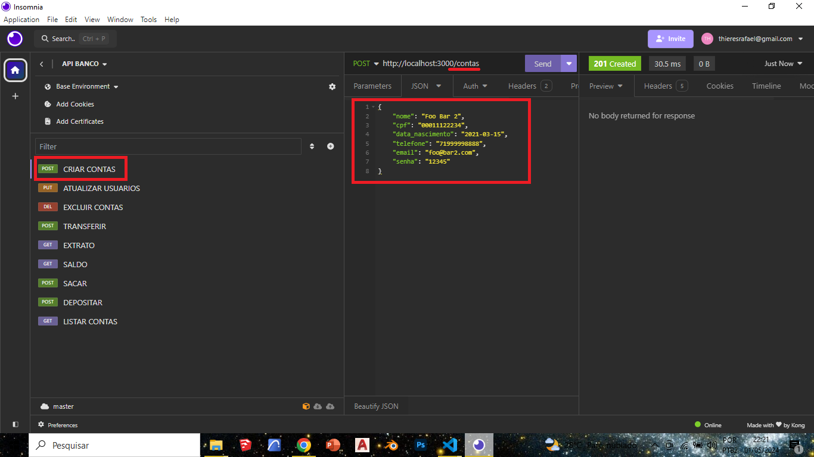

<h4 align="center"> 
	💲 Banco Digital 💲
</h4>

<p align="center">
	

</p>

<p align="center">
 <a href="#-sobre-o-projeto">Sobre</a> •
 <a href="#-funcionalidades">Funcionalidades</a> •
 <a href="#-como-executar-o-projeto">Como executar</a> • 
 <a href="#-tecnologias">Tecnologias</a> • 
 <a href="#-contribuidores">Contribuidores</a> • 
</p>


## 💻 Sobre o projeto

 API para um Banco Digital. Esse será um projeto piloto, ou seja, no futuro outras funcionalidades serão implementadas, atualmente conta com as seguites funções:


---

## ⚙️ Funcionalidades

- Criar conta bancária

- Listar contas bancárias
- Atualizar os dados do usuário da conta bancária
- Excluir uma conta bancária
- Depósitar em uma conta bancária
- Sacar de uma conta bancária
- Transferir valores entre contas bancárias
- Consultar saldo da conta bancária
- Emitir extrato bancário
---

## 🛣️ Como executar o projeto

### Pré-requisitos

Antes de começar, você vai precisar ter instalado em sua máquina as seguintes ferramentas:
[Git](https://git-scm.com), [Node.js](https://nodejs.org/en/). 
Além disto é bom ter um editor para trabalhar com o código como [VSCode](https://code.visualstudio.com/)

#### 🎲 Rodando o Backend (servidor)

```bash

# Clone este repositório
$ git clone git@github.com:Thesrael/Api-para-banco-digital.git

# Acesse a pasta do projeto no terminal/cmd
$ cd api-para-banco-digital

# Instale as dependências
$ npm install express
$ npm install -D nodemon

# Execute a aplicação em modo de desenvolvimento
$ npm run dev:server

# O servidor inciará na porta:3000 - acesse http://localhost:3000 

```
<p align="center">
  <a href="https://github.com/cubos-academy/academy-template-readme-projects" target="_blank"></a>
</p>

---

## 🛠 Tecnologias


---

## 💪 Como contribuir para o projeto

1. Faça um **fork** do projeto.
2. Crie uma nova branch com as suas alterações: `git checkout -b my-feature`
3. Salve as alterações e crie uma mensagem de commit contando o que você fez: `git commit -m "feature: My new feature"`
4. Envie as suas alterações: `git push origin my-feature`

---

## 🧙‍♂️ Autor

